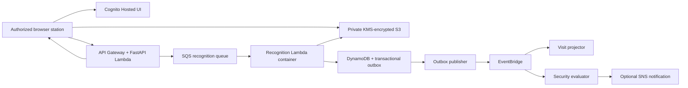

# GateSight

GateSight turns a camera at a vehicle gate into a capture, recognition, visit, and alert workflow.

The browser takes the pictures first. AWS processes them asynchronously. A slow model or temporary queue backlog can delay the answer, but it cannot stop the operator from capturing the vehicle.

[Open GateSight](https://gatesight.pages.dev) · [Browse the documentation](docs/README.md)

> GateSight is an independent portfolio project. It is not affiliated with, sponsored by, or endorsed by Cox Automotive, Manheim, or any other vehicle marketplace or automotive company.

## Start here

| If you want to… | Go here |
| --- | --- |
| Understand the product | [What GateSight does](#what-gatesight-does) |
| See the system design | [Architecture](#architecture) |
| Run it locally | [Local development](#local-development) |
| Test the full workflow | [Testing](#testing) |
| Operate or troubleshoot it | [Production runbook](docs/RUNBOOK.md) |
| Review security and privacy | [Security](docs/SECURITY.md) and [privacy](docs/PRIVACY.md) |
| Understand model limits and rights | [Model card](docs/MODEL_CARD.md) |
| Deploy it | [Deployment](#deployment) |

## What GateSight does

An authorized operator:

1. Signs in.
2. Chooses a facility and an `ENTRY` or `EXIT` gate.
3. Selects a connected camera.
4. Captures manually or lets automatic capture trigger.
5. Watches the result move from upload to recognition.

GateSight then:

- saves the approved image burst to private, encrypted S3;
- detects and reads the plate with a pretrained ALPR pipeline;
- stores the evidence and decision in DynamoDB;
- opens or closes a vehicle visit;
- creates review work when evidence is uncertain;
- evaluates high-confidence entries against registered vehicles; and
- exposes queue, worker, outbox, and station health.

The goal is not “OCR at any cost.” The goal is a trustworthy gate record that keeps the lane moving.

## The 60-second workflow

```text
Camera
  ↓
4 in-memory frames
  ↓
Local plate-likeness check
  ↓
Private S3 upload
  ↓
SQS recognition queue
  ↓
FastALPR + multi-frame consensus
  ↓
Observation saved
  ├─ Visit opened or closed
  ├─ Human review requested
  └─ Guarded security evaluation
```

### What happens in the browser

- The app requests video only—never microphone access.
- The operator can choose any camera exposed by the browser.
- Manual and automatic capture use the same four-frame path.
- Frames stay in memory until upload or discard.
- At least two frames must show plate-like character structure before upload.
- Blank scenes and simple non-character patterns are discarded without upload.
- Closing the tab before upload can lose the frames because GateSight intentionally creates no offline copy.

### What happens in AWS

- The browser uploads JPEGs directly to private S3.
- The control API verifies every expected object before queueing work.
- SQS buffers recognition and handles retry/backpressure.
- A Python Lambda container runs detection, crop processing, OCR, and consensus.
- One DynamoDB transaction saves the observation, capture result, and outbox event.
- EventBridge sends the completed result to independent visit and security consumers.

## Why capture comes first

A gate should not miss a vehicle because a model is cold or a queue is busy.

GateSight separates two jobs:

- **Capture now:** time-sensitive and controlled by the operator.
- **Recognize next:** CPU-heavy, retryable, and asynchronous.

That separation gives the system three useful properties:

1. **Throughput:** the lane does not wait on inference.
2. **Recovery:** failed recognition can retry without retaking the picture.
3. **Evidence:** the original burst, candidates, quality signals, and decision stay connected.

## Architecture



There is no always-running server, database instance, cluster, load balancer, VPC, or NAT Gateway. Compute scales to zero.

For trust boundaries, consistency rules, state transitions, and topology, read [Architecture](docs/ARCHITECTURE.md).

## Recognition without overclaiming

The production profile uses:

- `fast-alpr==0.4.0`
- `fast-plate-ocr==1.1.0`
- `open-image-models==0.5.1`
- YOLO v9 plate detection
- global CCT plate OCR
- OpenCV preprocessing
- ONNX Runtime CPU

GateSight does not accept a reading simply because one frame produced text.

Automatic recognition requires compatible evidence across usable frames. Conflicting high-confidence readings go to review. Multiple plausible plates go to review. If the detector returns no candidate, GateSight says review is required—it does not claim that no plate was present.

Current outcomes are:

| Outcome | Meaning | Automatic security alert? |
| --- | --- | --- |
| `RECOGNIZED` | Evidence supports a normalized plate | Only for guarded, high-confidence entries |
| `NEEDS_REVIEW` | Evidence is incomplete, weak, or absent | No |
| `MULTIPLE_PLATES` | More than one plausible plate | No |
| `FAILED` | Processing could not finish | No |

Legacy `NO_PLATE` records remain readable for contract compatibility and appear in the UI as `NOT DETECTED — REVIEW`.

Read the [Model card](docs/MODEL_CARD.md) for limitations, evaluation requirements, and release rights.

## Visits and alerts

### Visits

- A recognized `ENTRY` opens a visit.
- A recognized `EXIT` closes the compatible open visit.
- An exit without an entry creates an `ORPHAN_EXIT` anomaly.
- A repeated entry creates an anomaly instead of rewriting history.
- Duplicate observations stay auditable but do not create duplicate visits.

### Alerts

An unregistered or blocked-vehicle alert is eligible only when:

1. the station is an `ENTRY`;
2. the observation is `RECOGNIZED`;
3. consensus is high confidence; and
4. registration policy confirms the alert condition.

Review, failure, ambiguity, low confidence, and exits cannot create an unregistered-entry alert.

## Security and privacy

GateSight treats plates and vehicle images as sensitive operational data.

- Cognito uses OAuth 2.0 Authorization Code with PKCE.
- API Gateway validates JWTs.
- The API enforces role, tenant, facility, and object access.
- Images stay in private S3 with KMS encryption and Block Public Access.
- S3 upload policies restrict key, MIME type, byte size, and expiry.
- DynamoDB, SQS, SNS, and logs use encryption controls.
- Full plates and images are excluded from logs, metrics, email, and event payloads.
- No facial recognition or person identification is performed.
- Media deletion creates an audit record.

The UI is not a security boundary. The backend rechecks authorization on every protected operation.

Read [Security](docs/SECURITY.md), [Privacy](docs/PRIVACY.md), and [Failure modes](docs/FAILURE_MODES.md) before production use.

## Local development

### Prerequisites

- Python 3.12
- `uv`
- Node.js 22
- Terraform 1.9+
- a modern browser with camera permission on `localhost`

Docker is needed only when you build or run the recognition container locally. GitHub Actions can build and publish that container remotely.

### Start the app

```bash
cp apps/web/.env.example apps/web/.env
make bootstrap
make dev-api
```

In another terminal:

```bash
make dev-web
```

Open the local URL printed by Vite and sign in with a valid development identity.

### Seed portfolio facilities

Preview the Atlanta, Dallas, and San Diego records:

```bash
uv run python scripts/seed_portfolio_locations.py
```

Apply only missing records:

```bash
uv run python scripts/seed_portfolio_locations.py --apply
```

The script is idempotent. It does not overwrite conflicting records.

## Testing

Run the fast checks:

```bash
make test-unit
make lint
npm --prefix apps/web run test
```

Run broader suites when the required environment is available:

```bash
make test
make test-integration
make test-e2e
make security
make build-worker
```

Mocks prove local boundaries; they are not presented as AWS integration evidence. Real AWS tests require explicit credentials and a temporary authorized environment. Camera behavior still needs the [physical camera checklist](docs/PHYSICAL_CAMERA_TEST_CHECKLIST.md).

Read [Testing](docs/TESTING.md) for the scenario map.

## Deployment

### AWS

The worker deployment workflow uses GitHub OIDC—never static AWS keys.

At a high level:

1. Configure remote Terraform state.
2. Bootstrap ECR once.
3. Build and verify the pinned models.
4. Publish the worker by immutable image digest.
5. Sign and verify the image with Cosign.
6. Package the ZIP Lambdas.
7. Review and apply Terraform.
8. Run authenticated smoke and physical camera tests.

The recognition worker can be built entirely in GitHub Actions; local Docker Desktop is not required for that path.

### Cloudflare Pages

Build-time variables supply the API, S3, and Cognito origins. The build generates:

- a restrictive Content Security Policy;
- camera permission for the application only;
- no microphone, geolocation, payment, or USB permission;
- no-store caching for `index.html`; and
- SPA routing through `_redirects`.

Production and preview domains must also exist in Cognito callbacks, API/S3 CORS, and the generated CSP.

## Model and commercial-use gate

The current pretrained model packages advertise permissive code licenses, but separate weight-redistribution terms and complete training-data provenance were not found.

For the current portfolio deployment:

- weights stay inside a private ECR image;
- the repository does not redistribute them; and
- the deployment is non-commercial.

Commercial use or redistribution remains blocked until the exact artifacts receive written rights and provenance approval. See the [Model card](docs/MODEL_CARD.md) and `ml/model-manifest.json`.

## Known limitations

- Browser stations can be interrupted by sleep, updates, permissions, extensions, or camera drivers.
- Wake Lock is best effort.
- Internet loss before upload can lose an in-memory capture.
- Browser memory may be paged to disk by the operating system; GateSight makes no forensic zero-disk claim.
- Accuracy is not yet measured on a rights-cleared, facility-representative dataset.
- Confidence values are not automatically calibrated probabilities.
- A permanently unattended facility may need a managed kiosk or signed edge agent.

These are engineering constraints to measure and manage—not footnotes to hide.

## Documentation

Use [Documentation](docs/README.md) to choose the shortest path for your role.

Core references:

- [Architecture](docs/ARCHITECTURE.md)
- [Data model](docs/DATA_MODEL.md)
- [Event catalog](docs/EVENT_CATALOG.md)
- [Production runbook](docs/RUNBOOK.md)
- [Testing strategy](docs/TESTING.md)
- [Physical camera checklist](docs/PHYSICAL_CAMERA_TEST_CHECKLIST.md)
- [Security](docs/SECURITY.md)
- [Privacy](docs/PRIVACY.md)
- [Model card](docs/MODEL_CARD.md)
- [Cost assumptions](docs/COST.md)
- [Failure-mode matrix](docs/FAILURE_MODES.md)

## Repository map

```text
apps/web/                         React/Vite station and operations UI
services/control_api/             FastAPI/Mangum control plane
services/recognition_worker/      FastALPR Lambda container
services/outbox_publisher/        DynamoDB Streams → EventBridge
services/visit_projector/         Entry/exit visit projection
services/security_evaluator/      Registration and alert policy
packages/python_domain/           Domain models and policies
packages/contracts/               JSON Schema and OpenAPI
ml/evaluation/                    Reproducible model evaluation
infrastructure/terraform/         Dev/prod AWS resources
docs/                             Architecture, operations, and assurance guides
tests/                            Unit, integration, and browser suites
```
