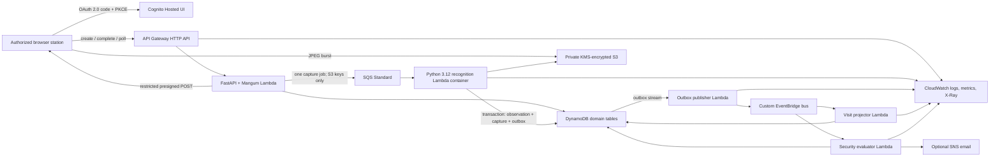
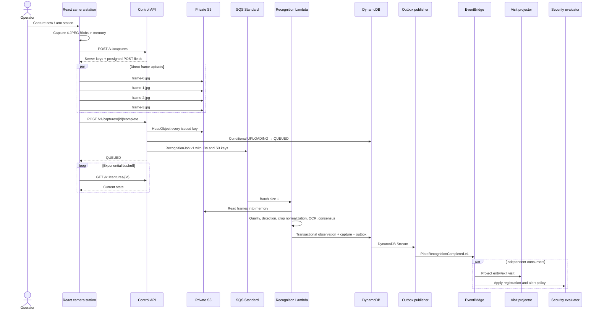

# GateSight

GateSight is a capture-first, AWS-native license-plate recognition system for vehicle yards, auctions, parking operations, and facility gates. An authorized operator opens the Cloudflare-hosted React application on a modern computer, grants video-only camera permission, selects a logical entry or exit gate, and captures a short image burst. The browser uploads those frames directly to private S3; recognition happens later through SQS and a Python Lambda container.

The operational objective is simple: keep the lane moving while preserving trustworthy evidence, tenant isolation, and a human path for uncertain results. A Lambda cold start can delay recognition, but it can never prevent the browser from taking the photographs.

> GateSight is an independent portfolio project. It is not affiliated with, sponsored by, or endorsed by Cox Automotive, Manheim, or any other vehicle marketplace or automotive company.

## The gate problem

At an unattended gate, synchronous OCR couples three failure domains to the driver’s immediate experience: camera capture, network/model availability, and recognition latency. A slow cold start or temporary queue backlog should not make an operator miss the vehicle. GateSight therefore captures a burst before it starts recognition work, returns upload instructions quickly, and exposes processing state through polling with exponential backoff.

This design favors operational throughput and auditability:

- The camera produces three to five frames while the vehicle is still aligned.
- Frames upload directly to private S3 without passing through API Gateway or a Node server.
- SQS buffers CPU-compatible recognition work and absorbs bursts.
- The result, candidates, confidences, quality evidence, and timestamps are persisted together.
- Entry/exit projection and security evaluation run independently after recognition.
- Uncertain text is review work. It is never evidence that a vehicle is unregistered.

## Architecture



No VPC or NAT Gateway is required. Every compute component scales to zero.

## Event sequence



## What is event-driven

Recognition work and post-recognition domain reactions are event-driven. Capture-session creation, explicit completion, status reads, review, registrations, alert transitions, media deletion, and administration are request/response operations because the caller needs immediate validation or a clear result.

SQS is the durable recognition work queue. It supplies buffering, retry, backpressure, visibility timeouts, queue-age metrics, and a DLQ. Standard ordering is sufficient because consumers use capture timestamps, conditional writes, deterministic identifiers, and idempotency markers.

EventBridge begins only after recognition. At that point one versioned domain event has several independent consumers. EventBridge is not used as the work queue because it is not the right place for queue depth, worker backpressure, or DLQ redrive of CPU work.

S3 notifications are intentionally absent. One logical capture contains several objects and needs an explicit browser completion boundary; an object-created notification cannot prove the burst is complete. Kinesis is unnecessary for discrete gate observations. Step Functions adds orchestration to a single recognition stage without improving the workflow. ECS/Fargate keeps capacity and an operational control plane for an asynchronous bursty CPU workload that Lambda can run while scaling to zero. RDS is not required for the documented access patterns or transactions; DynamoDB provides conditional updates, transactions, TTL, streams, and on-demand billing.

## Core user workflows

### Camera station

The station requests `video` only, preferring 1920×1080 with ideal constraints so lower-resolution cameras still work. Camera labels are enumerated only after permission. The interface handles denied permission, no device, unreadable devices, ended tracks, camera changes, and offline state.

Manual capture and armed automatic capture use the same real path. Automatic mode monitors a configurable plate region using a small canvas, waits for motion to enter and briefly stabilize, then captures four JPEG frames approximately 250 ms apart. A cooldown suppresses immediate repeats. Screen Wake Lock is requested after the operator arms the station and reacquired after the page becomes visible.

Frames are `Blob` objects held only in memory. GateSight does not write them to local/session storage, IndexedDB, Cache Storage, OPFS, a service worker, or the filesystem; full images are never converted to base64. The capture canvas is cleared after encoding. Uploads retry with bounded exponential backoff while the page is open. The operator can abort and discard pending frames. A navigation warning appears while a burst is pending.

Browser implementations may spill memory to disk internally, so this is a guarantee of **no intentional local persistence**, not a forensic zero-disk guarantee. The availability tradeoff is explicit: closing the page, losing power, or losing the browser before upload can lose an image because GateSight does not create an offline copy.

### Processing and review

The page polls capture status with increasing delay. Terminal outcomes are:

- `RECOGNIZED`
- `NEEDS_REVIEW`
- `NO_PLATE`
- `MULTIPLE_PLATES`
- `FAILED`

`NEEDS_REVIEW` and `MULTIPLE_PLATES` are called out visibly. Security and administrators can inspect protected candidate evidence, confirm, correct, or reject. A correction appends an audit record; it never silently rewrites model evidence or historical visits.

### Visits

Camera stations are explicitly `ENTRY` or `EXIT`. A recognized entry opens a visit when no compatible visit is open. A recognized exit closes the current compatible visit and stores dwell duration. An exit without entry creates an orphan-exit anomaly. A second entry while a visit is still open creates a repeated-entry anomaly. Duplicate observations inside the configured direction/facility/plate window retain their observation records but suppress duplicate visit activity.

### Registrations and alerts

Registrations can be tenant-wide or facility-specific and have active dates plus `ACTIVE`, `EXPIRED`, or `BLOCKED` status. A security alert is eligible only when all of these are true:

1. The station direction is `ENTRY`.
2. The observation state is `RECOGNIZED`.
3. Consensus meets the configured high-confidence threshold.
4. No active authorization matches, or a blocked registration matches.

No-plate, failed, low-confidence, ambiguous, and review-required outcomes cannot be labeled unregistered. Exits do not create unregistered-entry alerts. Alert IDs are deterministic within a suppression window. Optional SNS email contains only a masked plate, facility, timestamp, confidence category, and authenticated dashboard link—never an image or full plate.

## Recognition pipeline

The production profile is pinned:

- `fast-alpr==0.4.0`
- `fast-plate-ocr==1.1.0`
- `open-image-models==0.5.1`
- detector: `yolo-v9-s-608-license-plate-end2end`
- OCR: `cct-s-v2-global-model`
- OpenCV headless preprocessing
- ONNX Runtime CPU

The Lambda image downloads checksum-pinned artifacts at **container build time**. Production sets `GATESIGHT_PRELOAD_MODELS=1`, so ONNX sessions initialize during module initialization, outside the handler. Invocation never downloads weights.

Each object is checked for MIME, byte length, JPEG boundaries, decoded shape, dimensions, and pixel count. Quality evidence includes Laplacian blur, exposure, glare, plate pixel width, and perspective handling. All plausible plates are retained; more than one plausible plate makes the result ambiguous. Crops are bounded, perspective-normalized where a stable quadrilateral is found, resized, and CLAHE-enhanced. Original, normalized, and enhanced crops are stored under the same private KMS and lifecycle controls for authorized evaluation.

Raw OCR is preserved. Lookup normalization only uppercases and removes non-alphanumeric separators. It never changes `O` to `0`, inserts a character, or uses a regional pattern as replacement evidence.

### Multi-frame consensus

The policy favors exact agreement across at least two usable frames. Candidate weight combines detector confidence, OCR confidence, character confidence evidence, blur, exposure, glare, perspective, and plate size. A small exact-agreement bonus is allowed. A conflicting high-confidence reading forces review even when another reading wins. Edit distance helps identify nearby disagreement but never silently corrects text.

Thresholds live in SSM Parameter Store and are cached briefly by Lambda Powertools. Defaults are engineering starting points—not scientifically calibrated claims. A labeled evaluation must approve any automatic-acceptance threshold.

FastALPR/FastPlateOCR were selected because the required profile supplies a small ONNX CPU detector/OCR integration, per-character evidence, and a global plate model without a permanently running inference service. EasyOCR is not the production engine because it is a general OCR stack with a larger production surface and does not match the selected plate-specific evidence path. PaddleOCR PP-OCRv6-small is an isolated evaluation challenger only. OpenALPR is not used. YOLOv12 is outside the selected profile, and Ultralytics YOLO26 is excluded unless an applicable Enterprise license is explicitly supplied. AGPL code and weights are excluded from the proprietary deployment path.

See [MODEL_CARD.md](docs/MODEL_CARD.md) and `ml/model-manifest.json`. The package repositories are MIT, but the release pages do not state separate weight redistribution terms or full training-data provenance. Consequently the manifest currently marks production redistribution `REVIEW_REQUIRED`. The image can be built and evaluated, but a proprietary production release must run `--require-redistribution-approval` after written confirmation and legal review. The repository does not pretend that package licensing answers weight licensing.

## Data and access patterns

GateSight uses separate on-demand DynamoDB tables for facilities, stations, captures, observations, registrations, visits, alerts, outbox, idempotency, and audit records. Every record carries `tenantId`. Queries use composite primary keys and sparse GSIs; routine APIs do not scan. The detailed key/index review is in [DATA_MODEL.md](docs/DATA_MODEL.md).

The worker commits three intentions atomically:

1. the immutable recognition observation,
2. the capture terminal state and observation link,
3. a `PENDING` outbox record.

The outbox stream publisher may publish an event twice if EventBridge accepted it immediately before the publisher failed to mark the row. Both consumers therefore use deterministic markers/conditional writes. Delayed or out-of-order events are evaluated against `estimatedCapturedAtServer`; historical records are never silently rewritten.

The event envelope is CloudEvents-inspired and includes `specversion`, ID, type, source, subject, time, content type, correlation ID, tenant ID, and data. It contains observation/capture IDs and lookup-safe metadata, not images, full plates, emails, or tokens.

## Capture timestamps

All persisted backend times are UTC:

- `capturedAtClient`
- `estimatedCapturedAtServer`
- `receivedAtServer`
- `uploadedAt`
- `processingStartedAt`
- `processingCompletedAt`
- facility timezone

Before arming, the station samples `/v1/time` three times and uses the lowest-round-trip estimate to calculate client clock offset. `estimatedCapturedAtServer` drives visit ordering. Original timestamps remain for audit. The interface displays current facility-local time.

## Authentication and authorization

Cognito Hosted UI uses OAuth 2.0 Authorization Code with PKCE. The public browser client has no client secret. OIDC state and tokens use `sessionStorage`, not `localStorage`, and are cleared on logout. Images never share authentication storage.

API Gateway validates the JWT. The FastAPI service then enforces:

- `ADMIN`
- `SECURITY`
- `OPERATOR`
- `VIEWER`
- verified `custom:tenant_id`
- facility membership from `custom:facility_ids`
- object tenant and facility on each access

The UI is not a security boundary. Full plate evidence is removed from responses to roles without security access.

To invite a reviewer, configure an AWS CLI session for the authorized account and run:

```bash
export GATESIGHT_USER_POOL_ID=us-east-1_example
export GATESIGHT_REVIEWER_EMAIL=reviewer@example.com
export GATESIGHT_TENANT_ID=ten_01EXAMPLE0000000000000000
export GATESIGHT_REVIEWER_GROUP=VIEWER
export GATESIGHT_FACILITY_IDS=fac_01EXAMPLE0000000000000000
bash scripts/invite_reviewer.sh
```

There is no anonymous access, demo credential, or seeded production record.

## Security, privacy, and retention

- S3 Block Public Access, Bucket Owner Enforced ownership, TLS-only policy, versioning, KMS encryption, lifecycle expiration, and POST policies constrained by exact key/MIME/size.
- No public media URL. The implemented API deletes media; short-lived authenticated GETs can be added only behind the same object-level authorization when the review UI requires rendering.
- KMS encryption for S3, DynamoDB, SQS, SNS, and encrypted log groups.
- Separate Lambda roles with resource-scoped operations.
- X-Ray and structured Powertools logs without plate values.
- Stable error codes and correlation IDs with exception redaction.
- Default raw retention: one day in dev, 30 days in production.
- DynamoDB TTL for idempotency and temporary capture records.
- Audit record after media deletion without retaining deleted bytes.
- No facial recognition or person identification.

Operators should post appropriate physical notice at monitored entrances and obtain a documented legal basis for plate/image processing. See [PRIVACY.md](docs/PRIVACY.md) and [SECURITY.md](docs/SECURITY.md).

## Failure and recovery

- Partial upload: completion fails without queueing; the open page can retry the failed frame.
- Expired presign: create a new capture session; issued keys are never accepted for another capture.
- Duplicate completion: idempotency record returns the prior result; SQS duplicates remain safe.
- Worker failure: SQS retries; after four receives, the message reaches the DLQ.
- Worker retry after commit: deterministic observation/outbox IDs detect the existing transaction.
- Outbox duplicate: consumers use event markers and conditional writes.
- EventBridge duplicate/delay: consumers fetch protected observation details and remain idempotent.
- Camera disconnect: ended/device-change state disarms unattended assumptions and displays a fault.
- Stale heartbeat: dashboard signal and alarm identify a station that claims to be armed but is no longer reporting.
- Unavailable browser/network: in-memory frames may be lost by design.

The [RUNBOOK.md](docs/RUNBOOK.md) gives DLQ inspection, redrive, rollback, alarm, and teardown procedures. [FAILURE_MODES.md](docs/FAILURE_MODES.md) contains the complete failure matrix.

## Observability

Every request and event carries correlation, tenant, facility, capture, observation, and model identifiers where applicable. Plate text is excluded from logs and metrics. Lambda Powertools supplies structured logging, traces, cold-start metrics, batch processing, and parameter caching. DynamoDB conditional records provide idempotency at business boundaries.

The CloudWatch dashboard covers capture creation, API volume/5xx, recognition queue depth and age, DLQ depth, worker invocations/errors/p95 duration, result categories, outbox iterator age, visit projections, alerts, and delivery failures. Terraform alarms include DLQ depth, queue age, Lambda errors/throttles, duration regression, API 5xx, outbox backlog, and stale camera stations. A scheduled Lambda scans only station operational fields every five minutes and emits a count; it never reads or emits plate/media data.

## Testing and evaluation

The local pyramid includes:

- pytest, Hypothesis, Ruff, mypy, Bandit, and dependency audit
- Vitest and React Testing Library
- Playwright Chromium and WebKit configuration with isolated camera API fixtures
- Terraform format/validate, TFLint, and Checkov
- Docker build, Trivy, model checksum verification, SBOM, and gitleaks
- a credential-gated suite for a real temporary AWS environment
- a physical camera checklist for Chrome, Edge, Safari, and Firefox

Mocks/moto are useful for unit boundaries but are not described as AWS integration proof. Real AWS tests require explicit credentials and a temporary dev environment.

The evaluation manifest records expected plate, region, lighting, weather, angle, glare, plate size/distance, temporary/permanent status, obstruction, allowed use, and provenance. Reports calculate detector precision/recall/mAP when boxes exist, OCR exact match, character error rate, end-to-end exact match, accepted coverage, accuracy among accepted, false unregistered-alert rate, review rate, latency, cold start, and image size.

Target acceptance criteria—not measured claims—are:

- at least 98% exact match among automatically accepted observations,
- false unregistered-alert rate below 0.1%,
- no alert from low-confidence observations,
- asynchronous p95 latency appropriate for the facility’s operating procedure.

No accuracy percentage is claimed because the repository ships no rights-cleared labeled vehicle dataset.

## Local development

Prerequisites: Python 3.12, `uv`, Node.js 22, Docker, Terraform 1.9+, and modern browser camera permission on `localhost`.

```bash
cp apps/web/.env.example apps/web/.env
make bootstrap
make dev-api
# another terminal
make dev-web
```

Local development still requires a valid identity. The API accepts explicit development claims only when `GATESIGHT_ENVIRONMENT=local`; production cannot use that path. No inference is mocked. To run the worker locally, download the manifest-pinned models and set `GATESIGHT_MODEL_DIRECTORY`, or build the production container.

Common commands:

```text
make bootstrap
make dev
make dev-web
make dev-api
make test
make test-unit
make test-integration
make test-e2e
make lint
make security
make build-worker
make build-lambdas
make evaluate-models
make tf-plan ENV=dev
make tf-apply ENV=dev
make deploy-web
make smoke
make destroy ENV=dev
```

## AWS deployment

Production deployment is credential- and approval-dependent. The workflow uses GitHub OIDC; static AWS keys are not supported.

1. Create the remote Terraform state bucket/lock table and copy `backend.hcl.example` to uncommitted `backend.hcl`.
2. Bootstrap the ECR repository once with an authorized targeted Terraform apply if the repository does not yet exist.
3. Build `services/recognition_worker/Dockerfile`; models download during build and checksums must match the manifest.
4. Push a Git-SHA tag, resolve its ECR digest, and provide `worker_image_uri` by digest.
5. Build Linux/arm64 ZIP functions with `make build-lambdas`.
6. Plan the dev environment and review IAM, deletion protection, lifecycle, email subscription, and account-wide enhanced scanning.
7. Apply dev, invite an operator, confirm SNS if configured, and run the real AWS suite.
8. Configure Cloudflare Pages variables from Terraform outputs and deploy the Vite `dist`.
9. Require the GitHub `prod` environment approval before production apply.

Exact variable examples are in each environment directory. Terraform defaults to `us-east-1` but accepts another region.

The deployment workflow enforces `--require-redistribution-approval` before any
image push and therefore fails intentionally until the weight terms are approved.
After approval, it publishes by immutable digest, signs that digest keylessly with
Cosign through GitHub OIDC, and verifies the signature before Terraform can deploy it.

## Cloudflare Pages

The build generates `_headers` from the configured API, S3, and Cognito origins. It sets a restrictive CSP, denies framing, disables microphone/geolocation/payment/USB, grants camera only to self, and disables caching of `index.html`. `_redirects` provides SPA routing. Production and preview origins must both be added to Cognito callback/logout URLs, API CORS, S3 CORS, and the build-time CSP.

Web Analytics is not enabled. If added later, events must never include capture IDs, plates, image URLs, user IDs, or authenticated route parameters.

## Cost profile

The architecture has no always-running compute, database instance, cluster, NAT Gateway, or load balancer. Main cost drivers are recognition Lambda memory-duration, S3 bytes/requests and KMS calls, DynamoDB requests/storage, CloudWatch logs, and optional enhanced scanning. The sample budget is $30/month dev and $100/month prod, but [COST.md](docs/COST.md) shows transparent example assumptions. Actual price validation belongs in the target region/account before approval.

## Known limitations

- A browser is less controllable than a managed edge appliance: OS updates, sleep policy, camera driver prompts, and tab lifecycle can interrupt an unattended station.
- Wake Lock is best effort and begins only after a user gesture.
- Camera enumeration labels are permission-dependent.
- There is no forensic guarantee that a browser never pages memory to disk.
- Internet loss before upload can lose the capture because offline persistence is intentionally absent.
- Plate performance is not yet measured on a rights-cleared facility-specific dataset.
- Regional plate patterns are supporting review evidence, not a correction engine.
- Timestamp offset estimation is useful but is not a trusted hardware time source.
- The current model weights require explicit redistribution/provenance approval before a proprietary production release.

For a permanently unattended gate, the next architectural review should compare this station with a managed kiosk or signed local capture agent that can enforce camera health, OS policy, and supervised restarts.

## Production-hardening priorities

1. Obtain explicit detector/OCR weight redistribution and training-data provenance confirmation; record legal approval in the manifest.
2. Assemble a rights-cleared, facility-representative labeled dataset and calibrate thresholds against the false-alert objective.
3. Deploy a temporary dev environment and complete real camera + AWS + DLQ + rollback exercises.
4. Add authorized, short-lived media rendering to the review page with purpose-bound audit records.
5. Extend the scheduled heartbeat evaluator with facility operating-hour calendars so overnight maintenance windows can be muted automatically.
6. Run load/backpressure tests with the expected burst rate and reserve Lambda concurrency if measurements justify it.
7. Add WAF/rate rules and organization-level CloudTrail/GuardDuty/Security Hub controls in the target landing zone.
8. Decide whether an unattended production site needs a managed kiosk/edge agent based on physical trials.

## Repository map

```text
apps/web/                         React/Vite station and operations UI
services/control_api/             FastAPI/Mangum control plane
services/recognition_worker/      FastALPR Lambda container
services/outbox_publisher/        DynamoDB Streams → EventBridge
services/visit_projector/         Idempotent entry/exit projection
services/security_evaluator/      Registration and alert policy
packages/python_domain/           Pure domain models and policies
packages/contracts/               JSON Schema and exported OpenAPI
ml/evaluation/                    Reproducible primary/challenger metrics
infrastructure/terraform/         Dev/prod AWS resources
docs/                             ADRs, runbooks, threat/privacy/model docs
tests/                            Unit, integration, and browser suites
```

Start with [ARCHITECTURE.md](docs/ARCHITECTURE.md), [DATA_MODEL.md](docs/DATA_MODEL.md), [EVENT_CATALOG.md](docs/EVENT_CATALOG.md), and the ADRs for the reasoning behind the system.
